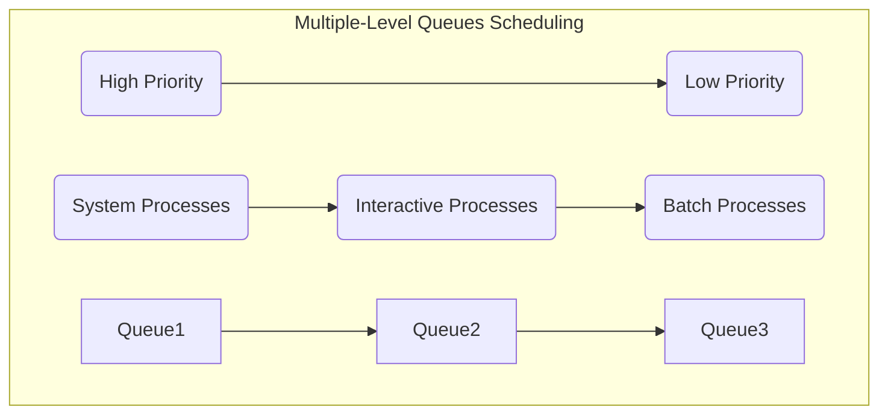

# {OS} 0. Questions

Course: Operating Systems (Operating%20Systems%20f7a5c52a1398467487fc5042b3a10069.md)
Confidence: Not Confident
Last Edited: September 9, 2024 11:11 PM

July 29, 2024 

## Q1. Write down the differences b/w all four computer generations

## First Generation ( 1945 - 1955 )

- No OS existed
- Vacuum Tubes
- Punch Cards ( Magnetic Tapes / Cards )
- Operator ( Manually collects operations to do )
- Offline Mode
- Consumed More Electricity; More Heat Generated
- No protection

- ~~Plug Boards~~

## Second Generation ( 1955 - 1965 )

- GMOSIS
- For IBM, GM created it
- Because it gathers all related jobs into groups ( batches ) & then submits them to the OS using a punch card to finish all of them
    - Built on a single stream batch operating system
- Transistors were used
- There was minimum protection
- I/O operation-processor had to remain IDLE
- Base for multi-programming

## Third Generation ( 1965 - 1980 )

- Multi programming & multi tasking
- Integrated Circuits ( IC ) were used
- No starvation
    
    <aside>
    ❓ Starvation - Low Priority Processes can’t execute because High Priority Processes are blocking them from executing.
    
    </aside>
    

## Fourth Generation ( 1980 - Present )

- Development of Microsoft & Windows OS.
- Provided GUI
- No Starvation
- Maximum CPU Utilisation
- Computer Networking
- Provides High Priority Execution

---

## Q2. Write the major differences in FCFS, SJF, SRTF, RR, Priority

---

## FCFS

- First Come First Serve
- Non Preemptive
- Criteria :  Arrival Time

---

## SJF

- Shortest Job is executed first
- Non Preemptive
- Criteria : Burst Time

---

## Priority Non Preemptive

- Executed based on assigned priority
- Non Preemptive
- Criteria : Highest Priority

---

## Round Robin

- Executes for a set period of time
- Preemptive
- Criteria : Time Quantum

---

## SRTF

- Shortest Time Remaining First
- It just a Preemptive SJF
- Criteria : Burst Time

---

## Priority Preemptive

- Executed based on assigned priority
- Preemptive
- Criteria : Highest Priority

---

---

---

## Q3. Write a note on Multilevel Queue Scheduling

- It is not an independent scheduling algorithm. It make use of other existing algorithms to group & schedule jobs with common characteristics.
- Multiple queues are maintained for processes with common characteristics.
- Each queue can have its own scheduling algorithms.
- Priorities are assigned to each queue.
- It is preemptive

Ready Queue is divided into separate queues for each class of process

1. System Processes
    
    Processes run by the CPU itself
    
2. Interactive Processes
    
    A type of process in which there should be the same type of interaction.
    
3. Batch Processes
    
    Collects the programs and data together in the form of a **batch** before the **processing** starts.
    

---

## Q4. Explain the concept of Threads with multithreading

**Thread** is a path that is followed during a program’s execution.
eg : a program is not capable of reading keystrokes while making drawings. This problem can be solved through multitasking so that two or more tasks can be executed simultaneously.

---

**Multithreading** is a feature in operating systems that allows a program [****](https://www.geeksforgeeks.org/what-is-a-computer-program/)to do several tasks at the same time.

Multithreading works by allowing a computer’s processor to handle multiple tasks at the same time. Even though the processor can only do one thing at a time, it switches between different threads from various programs so quickly that it looks like everything is happening all at once.

- **Processor Handling**: The processor can execute only one instruction at a time, but it switches between different threads so fast that it gives the illusion of simultaneous execution.
- **Thread Synchronization**: Each thread is like a separate task within a program. They share resources and work together smoothly, ensuring programs run efficiently.
- **Efficient Execution**: Threads in a program can run independently or wait for their turn to process, making programs faster and more responsive.
- **Programming Considerations**: Programmers need to be careful about managing threads to avoid problems like conflicts or situations where threads get stuck waiting for each other.

---

## Q5. Interprocess Communication w/ methods

Inter-process communication is the mechanism provided by the OS that allows processes to communicate with each other. There are 2 types of processes : Independent/Cooperative & Dependent.

### Dependent Process

1. Shared Memory
    
    The two processes share a common memory location known as a **buffer**.
    
2. Message Parsing
    
    Processes communicate with each other without using any kind of shared memory.
    

Inter-process communication is the mechanism provided by the OS that allows processes to communicate with each other. There are 2 types of processes : Dependent & Independent/Cooperative

- Todo
    1. Write a note on MultiLevel Queue Scheduling w/o using ChatGPT
    2. Explain the concept of threads with multthreading