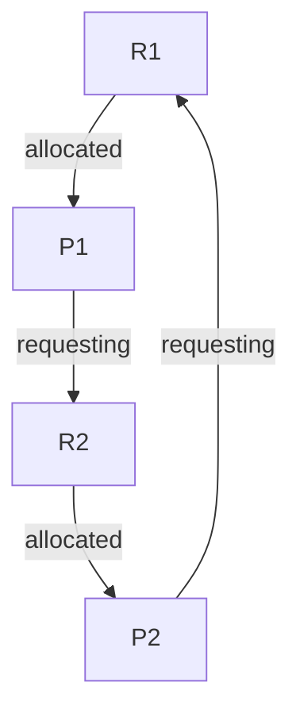

# {OS} Synchronization Mechanisms

Course: Operating Systems (Operating%20Systems%20f7a5c52a1398467487fc5042b3a10069.md)
Confidence: Not Confident
Last Edited: September 11, 2024 10:50 AM

Synchronization is the process of preventing two processes from executing the critical section simultaneously.

### Busy waiting and sleep waiting (without busy waiting)

**Busy waiting** is defined as a process synchronization technique where the process waits and continuously keeps on checking for the condition to be satisfied before going ahead with its execution.

This method is also not viable since it *wastes CPU resource*. This is because other process are close to critical section, in an infinite loop thus wasting CPU resource.
Also *Busy waiting* does not consider the priority of the processes.

Due to this disadvantage of busy waiting, *sleep waiting* is used.

---
**Sleep waiting** simply says that if the process is waiting for the lock on critical section, process goes to sleep until the lock is lifted.

The process which is executing the critical section notifies the sleeping process when its done executing the critical section. In some cases, the OS may also notify the sleeping processes.

---

#### Sleep and wake up calls

##### Semaphores:
- `wait`, `sleep` and `down` (`P`)
- `signal`, `wake-up` and `up` (`V`)

---

```c
  #define BufferSize 100;
  int count = 0;

  Producer()
  {
    int item;
    WHILE (true) {                   // loop forever
      item = produce_item();              // create a new widget to put in the buffer
      if(count==BufferSize)
           Sleep();                  // if the buffer is full, sleep
      insert_item(item);              // put the item in the buffer
      count = count + 1;             // increment count of items
      IF (count>=1)
         Wakeup(Consumer);           // if the buffer was previously empty, wake
   }                                 //  the consumer
  }

  Consumer()
  {
    int item;
    while(true) {                    // loop forever
      IF(count==0)
           Sleep();                  // if the buffer is empty, sleep
      item = remove_item();           // take an item from the buffer
      count = count - 1;             // decrement count of items
      IF(count<=N-1)
            Wakeup(Producer);        // if buffer was previously full, wake
                                     //  the producer
      Consume_item(widget);          // consume the item
     }
   }
```

## Semaphores

Semaphores are just normal variables used to coordinate the activites of multiple processes in a computer system. They are used to enforce mutual exclusion, avoid race conditions, and implement synchronization between processes.

It is used to solve the critical section problem.

It is to be noted that semaphores are shared variables.

`P` and `V` are semaphores helper functions. `S` is a semaphore variable.

```js
P(Semaphore S) {
	while(S == 0){}
	S = S - 1;
}

V(Sempahore S) {
	S = S + 1;
}
````


### Monitors

In an program, we have a set of shared variables.

using **Monitors** is similar to critical section, where only one process can enter the monitor section.

However, in case of monitors, the process has to go through _procedures_ to access the variables. On the other hand, processes can directly access the critical section.

---

#### Classical synchronization problems

### Dining Philosophers problem

There are 5 philosophers sitting on a circular table. There are only 5 forks. Only 2 philosophers can eat at the same time. The solution involves synchronizing philosophers so that everyone can eat their portion equally.

### Reader-Writer problem

There are multiple readers and writers that are trying to access the database to perform some operations. The solution should synchronize in such a way that data integrity and consistency is maintained.

### Sleeping Barber Problem

Initially, the barber is sleeping.

When the first customer arrives, it wakes up the barber. If another customer arrives while the barber is busy, they must wait for the barber to finish. However, if it's taking too much time, then the customer may leave.

Once the barber has finished doing its job, then it will check if there are any customers waiting outside, if there are no customers then the barber will go to sleep until another customer wake him up.

We have to use 3 semaphores in this problem.

---

### Deadlock

Deadlock is a situation in computing where two or more processes are unable to processed because each is waiting for the other to release resources. A condition when 2 or more processes sharing the same resource are effectively preventing each other from accessing the resources known as deadlock.

In case of deadlock, the processes goes into infinite waiting state since the resource it has requested are not available.




There **4 conditions to achieve deadlock**:
1. Mutual exclusion
2. Hold & wait
3. Circular path
4. non-preemption

##### Operations
In normal operation, a process must request a resource before using it and release it when finished, as show below

- Request :- If the request cannot be granted immediately, the process must wait until the resource(s) required to become available. The system, for example, uses the functions open() malloc(), new() and request().
- Use
- Release

##### *Necessary conditions* in order to achieve *deadlock*

1. **Mutual exclusion**:- at least one resource must be kept in a non-shareable state. If another process requests it, it must wait for it to be released.
2. **Hold and wait**:- A process must hold at least one resource while also waiting for at least one resource that another process is currently holding.
3. **No preemption**:- Once a process holds a resource, that resource cannot be taken away from that process until the process voluntarily release it
4. **Circular wait**:- There must be a set of processes $P0, P1, P2,....PN$ such that every $P[i]$ i waiting fro $P[(i + 1)]$ 

Resources can be memory, CPUs, printers, open files, tape drives, CD-ROMs and I/O devices.

There are different types of resources such as:
- Active resource --> CPU, network adapter
- Passive resource --> memory
- Shared resource

### Methods for handling deadlocks
There are mainly four methods for handling deadlocks:-
- **Deadlock prevention**
Prevent one condition out of four from being satisfied, thus preventing the deadlock

- **Deadlock avoidance**
By using multiple resources, we can avoid the deadlock
(?) find more avoidance

- **Deadlock detection & recovery**
We keep checking the four conditions and for every condition that is satisfied, we try to recover from it.

- **Deadlock ignorance** ignored successfully
---

### Memory Management 

***Updated till 24th September***

To achieve a degree a multi-programming and proper utilization of memory; memory management is important.

The task of sub-dividing the memory into different processes is called *memory management*.
$OR$
Memory management is one of the method in the operating system to manage operations between main memory(RAM) and ROM during processes execution.

Memory management keeps track of each and every memory location, regardless of either it is allocated to some process or it is free.

==Address Binding== means mapping computer instructions and data to locations in RAM.

There are **three types of addresses** used in a program before and after memory is allocated:-
- **Symbolic address**:- used in a source code(e.g., variable names, constants, and instruction labels)
- **Relative address**:- At the time of compilation, a compiler converts symbolic addresses into relative addresses.
- **Physical address**:- The *loader* generates these addresses at the time when a program is loaded into main memory

---
#### Physical and Logical address
There are **two types of major** addresses in *process(programs?)*
- **Physical addresses**:- these are in the memory
- **Logical/Virtual addresses**:- these are in the CPU and generated by the CPU itself

In computer systems, a hardware device named memory management unit (**MMU**) is used to map the logical address to its corresponding physical address.

The logical address generated by the CPU gets added with *Relocation register* to get the physical address.


---
**Similarities** between logical and physical addresses:-
- Both are used to identify a specific location in memory
- Both can be represented in different formats such as binary, 0x and decimal
- Both have a finite range, which is determined by the number of bits used to represent them

**Important Points**
- The MMU translates logical into physical using page tables which contains the mapping (and also a cache) between mapping.

---
### Contiguous memory allocation

It is a method in which a single contiguous section/part of memory is allocated to a process or file needing it. All available memory space resides in the same place together, which means that the freely/unused available memory partitions are not distributed in a random fashion here and there across the whole memory space.

---
There are two types of contiguous memory management has two types:

- **Fixed**(or **static**) partitioning
-allocation by diving the memory partitions into fixed size partitions. Only one process can be added into one slot in the partition.

*Internal fragmentation*:- when the process does not uses the entire allocated slot and other process comes with that memory requirement but it cannot be allocated that slot since only one process can do at once.
This difference between allotted and requested memory is called *internal fragmentation*.

*External fragmentation* is also there.

Each process gets the same amount of memory size thus this technique is also called *static partition schema*.

---
- **Variable**(or **Dynamic**) partitioning
**External fragmentation** happens when there's a sufficient quantity of are within the memory to satisfy the memory request of a method. But the allocated memory is in non-contiguous manner thus is not ideal for some use cases.

Dynamic allocation solves *internal fragmentation* but *external fragmentation is there*.

**(?) Advantages and Disadvantages of contiguous memory allocation**

---
### Non-contiguous memory allocation

Memory is allocated in different free locations to the process as per its requirements

Internal fragmentation can be minimized.

Slower execution since we have to jump to different memory location.


## Translation Lookup Buffer (*TLP*)

In Operating System (Memory Management Technique: *Paging*, for each process page table will be created, which will contain a *Page Table* Entry (PTE)]. This PTE will contain information like frame number (The address of the main memory where we want to refer), and some other useful bits (e.g., valid/invalid bit, dirty bit, protection bit, etc). This page table entry *PTE* will tell where in the main memory the actual page is residing. 

Now the question is where to place the page table, such that overall access time (or reference time) will be less. The problem initially was to fast access the main memory content based on the address generated by the CPU (i.e. *logical/virtual address*. Initially, some people thought of using registers to store page tables, as they are high-speed memory so access time will be less.

*TLP* is directly related to *page numbers* 


![[tlb1.jpg]]


